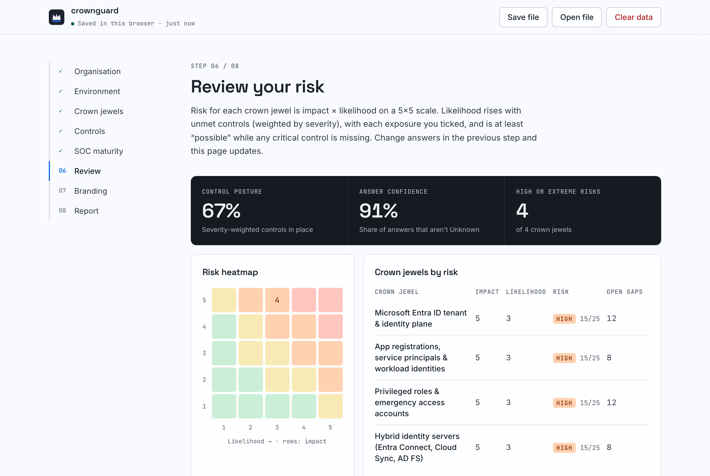
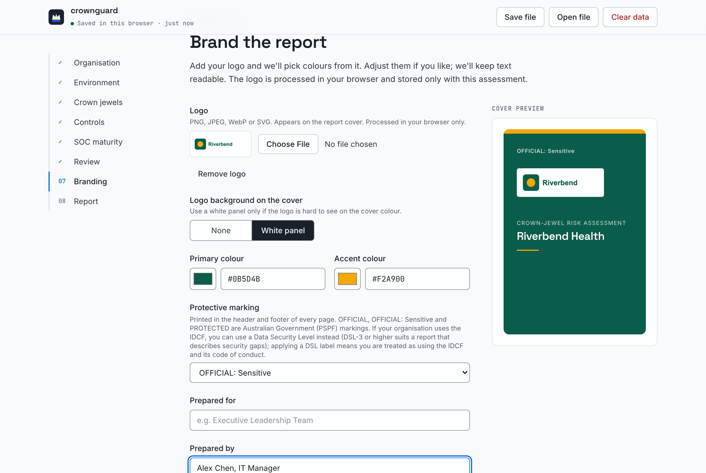
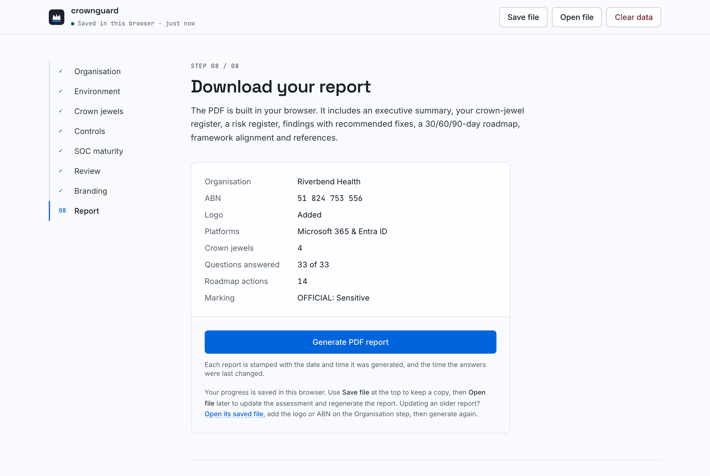
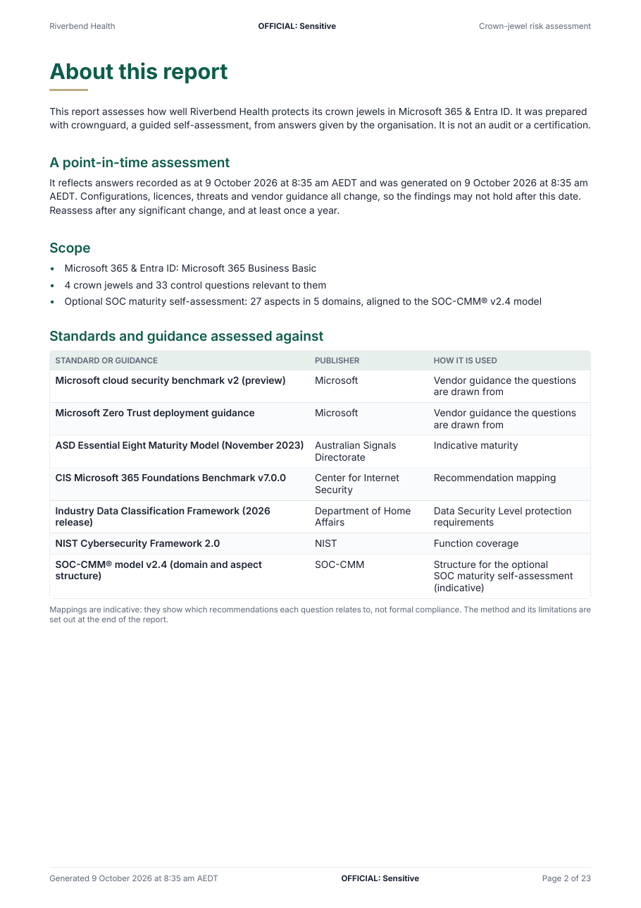
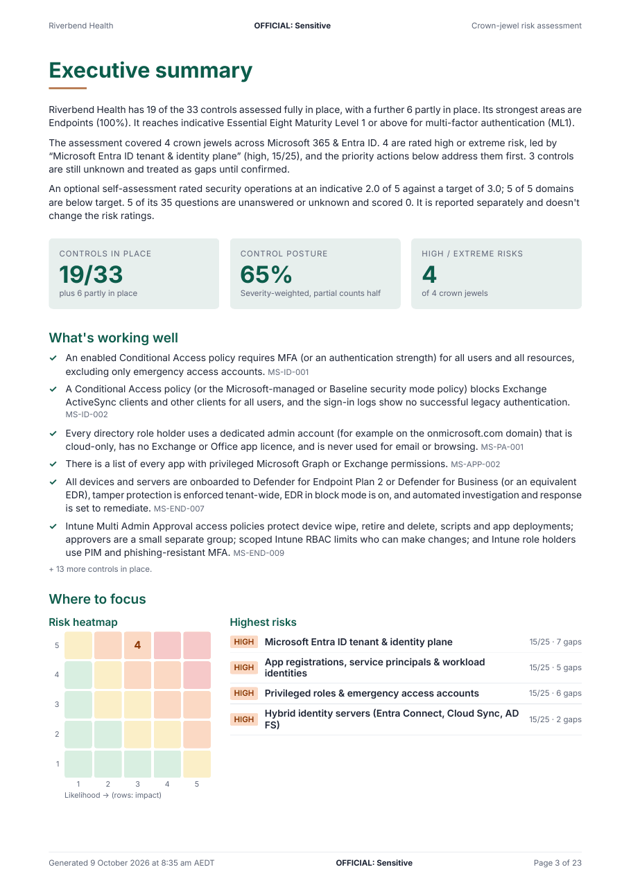
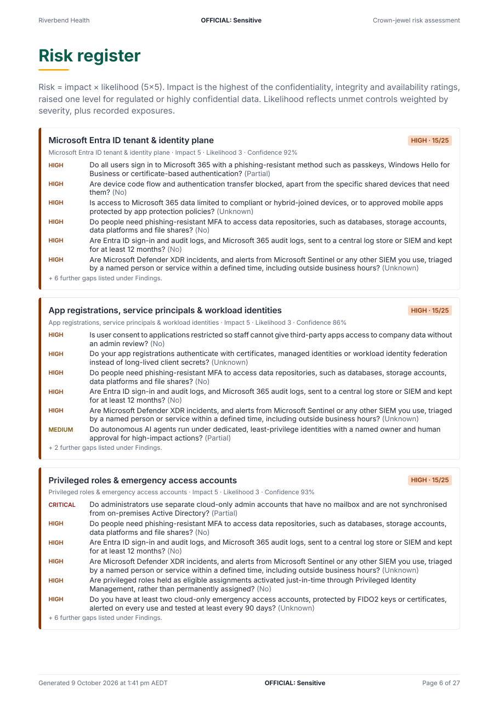
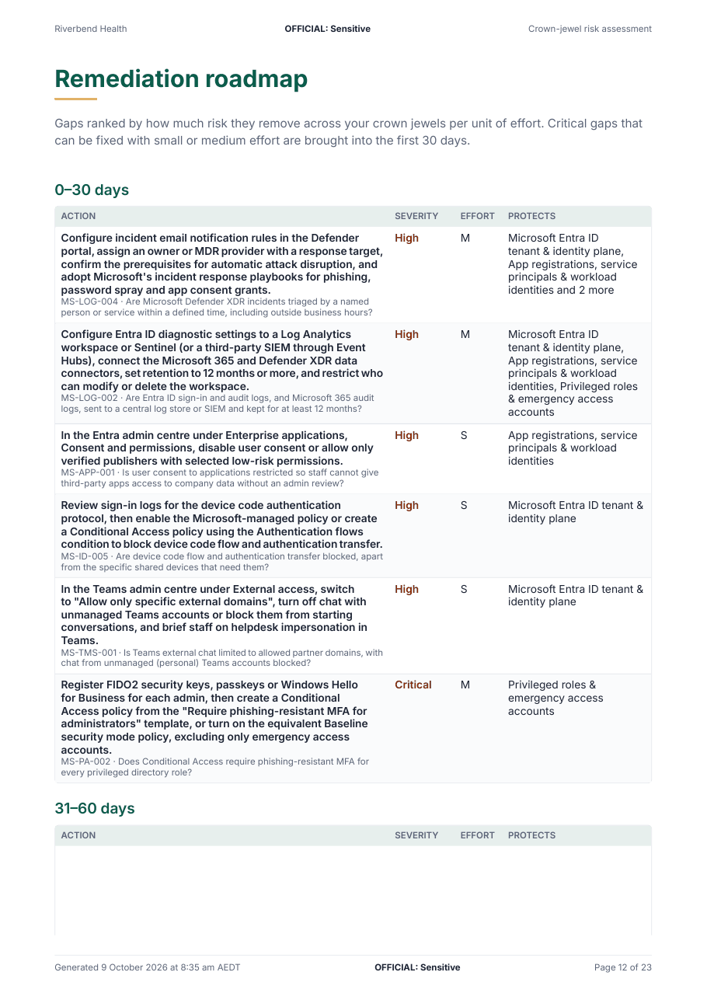
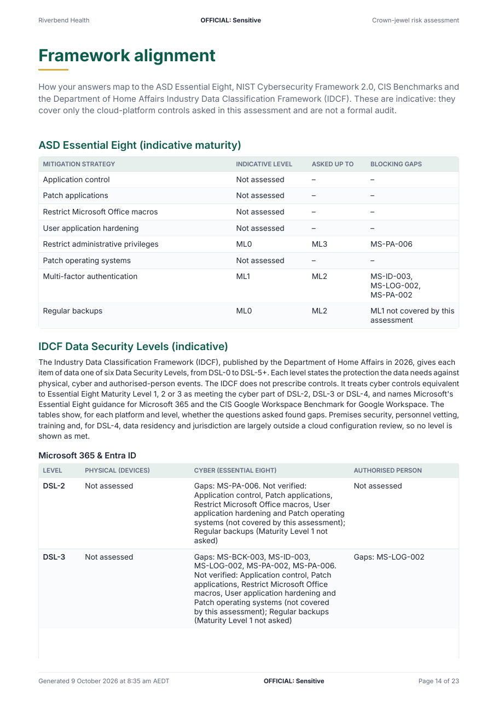
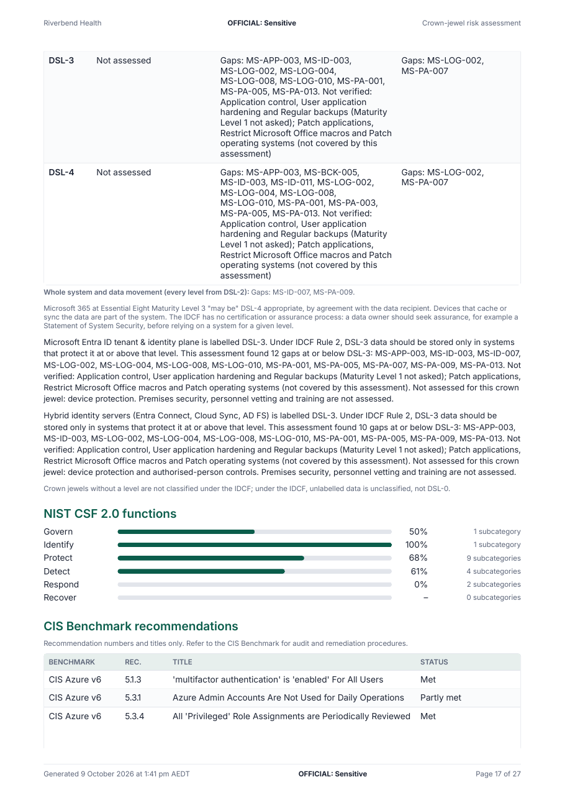
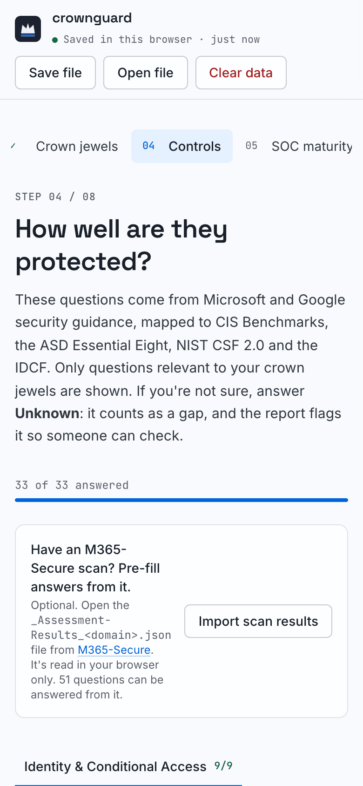

# crownguard

**Find your crown jewels in Microsoft 365 or Google Workspace, see how exposed they are, and hand leadership a branded PDF that explains the risk.**

crownguard is a guided self-assessment that runs entirely in your browser. You pick your environment, name the
systems and information that would hurt most if compromised (your Entra ID tenant, Global Administrators, the HR
SharePoint site, the finance shared drive, Gemini or Copilot's reach into your data), answer plain-language control
questions drawn from Microsoft and Google security guidance, and download a report themed with your organisation's
logo and colours.

Nothing you enter leaves your device. There is no backend, no account and no analytics.

**Try it: https://jusso-dev.github.io/crownguard/**

<p align="center">
  
</p>

## What you get

- **Crown-jewel discovery.** Guided prompts per category: identity plane, privileged access, business data,
  collaboration and email, endpoints, cloud infrastructure and AI assistants.
- **Vendor-grounded questions.** Each question cites the Microsoft or Google guidance it comes from and maps to
  CIS Benchmark recommendations, the ASD Essential Eight, NIST CSF 2.0 and the Department of Home Affairs Industry
  Data Classification Framework (IDCF).
- **Risk per crown jewel.** Impact × likelihood on a 5×5 matrix, driven by your answers, the exposures you record
  and how sensitive or regulated the data is.
- **A report people will read.** It opens by stating the scope, the standards it's assessed against and that it is a
  point-in-time assessment, then an executive summary, heatmap, crown-jewel register, risk register, findings with
  fixes and licence notes, controls marked N/A with the reason given, a 30/60/90-day roadmap, indicative Essential
  Eight maturity, IDCF Data Security Levels, NIST CSF coverage and references. Your logo, ABN, colours and protective marking, with the
  generation time and the time answers were last changed stamped on every report.
- **Save and come back.** Progress saves automatically in your browser as you go. Return later and you pick up
  on the same step and section. **Save file** (or Ctrl/⌘ S) writes a `.crownguard.json` copy without moving you off
  the question you're on; in Chrome and Edge later saves update the same file. **Open file** carries on from a saved
  copy, including older ones: open it, add a logo or ABN, and regenerate the report.
- **Optional scan import (Microsoft).** Already run [M365-Secure](https://github.com/jusso-dev/M365-Secure) against
  your tenant? Import its `_Assessment-Results_<domain>.json` on the Controls step to pre-fill answers (55 of the 108
  Microsoft questions have mapped checks) where its checks are decisive (all pass = Yes, all fail = No, mixed = Partial). Every pre-filled answer shows the scan
  evidence, you can change any of them, and the report says which answers came from the scan. The file is read in
  your browser only.
- **N/A must be justified.** Marking a control N/A asks why. Until a reason is given it counts as unanswered.
- **IDCF Data Security Levels.** Optionally record the IDCF Data Security Level (DSL-0 to DSL-5+) your data owner
  chose for each crown jewel. The report shows, for each platform and for DSL-2 to DSL-4, whether your answers found
  gaps in the physical, cyber and authorised-person protections the IDCF describes (the cyber part comes from
  indicative Essential Eight maturity, as the IDCF does), and checks each tagged crown jewel against its level. It
  never assigns levels for you or claims a level is met.
- **Optional SOC maturity assessment.** If you have a security operations centre, in house or through a managed
  provider, rate it on 37 plain-language questions structured on the five domains and 27 aspects of the
  [SOC-CMM®](https://www.soc-cmm.com/products/soc-cmm) v2.4 model. Each question describes what levels 0 to 5 look
  like (0 to 3 for technology and service capability), so a rating means the same thing every time. The report adds a
  radar against targets, an aspect profile, and what the next level up looks like for the eight largest maturity gaps
  and every capability gap. It is indicative, reported separately and never changes crown-jewel risk.

## A tour

The screenshots below follow one assessment for a fictional health provider, Riverbend Health, on Microsoft 365. They
are regenerated from the app itself (`SCREENSHOTS=1 pnpm exec playwright test e2e/screenshots.spec.ts`).

### 1. Organisation and environment

Start with the organisation: name, ABN (checked against the ATO check digit), sector, size and the obligations that
apply to it, such as the Privacy Act and its Notifiable Data Breaches scheme. A logo is optional and sets the report's
colours. Then choose the platforms in scope, Microsoft 365 and Entra ID, Google Workspace, or both, with their licence
tiers and optional Azure or Google Cloud modules.

<table>
  <tr>
    <td width="50%"></td>
    <td width="50%"></td>
  </tr>
</table>

### 2. Crown jewels

Guided prompts per category (identity plane, privileged access, business data, collaboration and email, endpoints,
cloud and AI assistants) help you name what would hurt most. Each crown jewel gets a classification, confidentiality,
integrity and availability ratings, the exposures that apply today (standing admin rights, guest access, unmanaged
devices, AI grounding), its obligations, and optionally the IDCF Data Security Level your data owner chose.
crownguard can suggest a level, but never fills it in for you.

<p align="center"></p>

### 3. Controls

Only the questions relevant to your crown jewels and licences are asked, grouped by domain. Each one explains why it
matters, what "yes" looks like and how to fix it, names any licence the fix needs, and lists the Microsoft or Google
pages it comes from plus its CIS, Essential Eight, NIST CSF 2.0 and IDCF mappings. Unknown counts as a gap; N/A needs a
reason. Microsoft tenants can pre-fill answers from an M365-Secure scan.

<p align="center"></p>

### 4. SOC maturity (optional)

If you have a security operations centre, in house or through a managed provider, rate it across the five domains and
27 aspects of the SOC-CMM® v2.4 model. Every question describes what each level looks like, so you pick the
description that matches today rather than a vague "partially". Technology and service aspects also get a capability
rating, aspects you genuinely don't need can be left out of scoring, and the targets default to SOC-CMM's (maturity 3,
capability 2).

<p align="center"></p>

### 5. Review

Risk for each crown jewel is impact × likelihood on a 5×5 matrix, recalculated as you answer. The Review step shows
control posture, answer confidence, the heatmap, crown jewels ranked by risk, posture by domain, indicative Essential
Eight maturity and the biggest gaps, plus the SOC maturity result when you included it.

<p align="center"></p>

### 6. Branding and the report

Set who the report is prepared for and by, the protective marking, and the colours (taken from the logo, or typed as
hex codes, with a contrast check). Then generate the PDF in the browser.

<table>
  <tr>
    <td width="50%"></td>
    <td width="50%"></td>
  </tr>
</table>

## The PDF

A report leadership will actually read: it opens with scope, the standards it was assessed against and a
point-in-time statement, then an executive summary, the crown-jewel register, a risk register, findings with fixes, a
30/60/90-day roadmap, framework alignment (Essential Eight, IDCF, NIST CSF 2.0, CIS) and, when included, the SOC
maturity section. Every page carries your marking and the time it was generated.

<table>
  <tr>
    <td width="33%"></td>
    <td width="33%"></td>
    <td width="33%"></td>
  </tr>
  <tr>
    <td>Cover, branded from the logo</td>
    <td>Scope and the standards used</td>
    <td>Executive summary</td>
  </tr>
  <tr>
    <td width="33%"></td>
    <td width="33%"></td>
    <td width="33%"></td>
  </tr>
  <tr>
    <td>Risk register</td>
    <td>30/60/90-day roadmap</td>
    <td>Essential Eight and IDCF</td>
  </tr>
  <tr>
    <td width="33%"></td>
    <td width="33%"></td>
    <td width="33%"></td>
  </tr>
  <tr>
    <td>IDCF Rule 2 check per crown jewel</td>
    <td>SOC maturity against target</td>
    <td>SOC priorities and next steps</td>
  </tr>
</table>

It works on a phone too: every step fits a 390px screen.

<p align="center"></p>

## Use it

Hosted: **https://jusso-dev.github.io/crownguard/** (GitHub Pages, built from `main`)

Or run it yourself:

```sh
pnpm install
pnpm dev        # http://localhost:5173
pnpm build      # static site in dist/, host anywhere
```

The build is a static site with no server code. Serve `dist/` from any static host; set `BASE_PATH` when it lives
under a sub-path (the Pages workflow uses `/crownguard/`). The Content Security Policy ships as a `<meta>` tag
because GitHub Pages can't send custom headers; on a host that can, also send the headers defined in
`vite.config.ts` (including `frame-ancestors 'none'`, which only works as a header).

Browser storage is per origin. On GitHub Pages that origin is shared by every Pages site under the same account,
so for sensitive assessments prefer **Save file**, a private window, or self-hosting on your own domain.

## How risk is scored

| | |
|---|---|
| Answers | Yes = 1, Partial = 0.5, No = 0. **Unknown and unanswered also score 0**: uncertainty is never treated as protection. N/A is excluded. |
| Weights | Critical 4, High 3, Medium 2, Low 1 |
| Impact (1–5) | Highest of the confidentiality, integrity and availability ratings, +1 for regulated or highly confidential data, max 5 |
| Likelihood (1–5) | 1 + 4 × weighted gap ratio of the questions relevant to the crown jewel, +0.5 per recorded exposure, rounded. At least 3 while any critical control is missing |
| Bands | 1–4 Low · 5–9 Medium · 10–19 High · 20–25 Extreme |
| Essential Eight | A maturity level counts only when every question at that level and below is Yes. Indicative only: cloud-platform controls, not a full ASD assessment |
| Roadmap | Gaps ranked by risk reduced across your crown jewels ÷ effort. Critical gaps with small or medium effort go into the first 30 days |
| IDCF | Cyber part of DSL-2, 3, 4 read from indicative Essential Eight Maturity Level 1, 2, 3; physical and authorised-person parts from the questions mapped to each level. A level shows gaps when any mapped question at or below it isn't Yes |
| SOC maturity | Each question rated 0–5 (capability 0–3) against its level descriptions; Unknown scores 0. An aspect's maturity is the mean of its maturity ratings and, for technology and services, its capability the mean of its capability ratings (never combined); a domain is the unweighted mean of its in-scope aspects. Default targets maturity 3, capability 2. Kept apart from the risk scores |

The code is in [`src/engine`](src/engine) with tests alongside.

## Content

All questions, crown-jewel categories, framework mappings and citations are YAML in [`content/`](content), so you
can improve them without touching code. See [docs/content-guide.md](docs/content-guide.md) and
[CONTRIBUTING.md](CONTRIBUTING.md).

The optional SOC maturity questions live in [`content/soc/`](content/soc), which is licensed CC BY-SA 4.0 because
it builds on the SOC-CMM® model's structure (see [its NOTICE](content/soc/NOTICE.md)).

Sources include Microsoft Learn (Zero Trust deployment guidance, Entra ID security operations, privileged access,
Conditional Access, Microsoft 365 Copilot oversharing guidance, Purview, Defender), Google Workspace Admin Help
(security checklists, administrator and super admin best practices, Drive, Gmail, Gemini) and Google Cloud
(enterprise foundations, organisation policies, Security Command Center), plus the ASD Essential Eight Maturity Model,
NIST CSF 2.0, the Home Affairs Industry Data Classification Framework and the SOC-CMM® model.

### Keeping the sources current

Vendor guidance moves, changes and retires. A nightly workflow ([`source-watch.yml`](.github/workflows/source-watch.yml))
re-reads every cited page and compares it with the fingerprints in [`watch/state.json`](watch/state.json). It opens a
pull request when a source:

- **breaks**: the page is gone, or fails on consecutive nights;
- **moves**: the same document now lives at a new address, so the PR updates the URL for you;
- **redirects elsewhere or retires**: it lands on a hub page, is archived, or is marked retired or "classic";
- **changes substantially**: sections added or removed, a large share of the text rewritten, or new deprecation or
  licensing language (with a diff excerpt where the page's licence allows quoting);
- **has a newer version**: for example a new CIS Benchmark release;
- **passes a deadline**: a date the page gives for a retirement or switch-off has arrived;
- **changes with the rest of its site**: when many pages on one site change on the same night (usually new page
  furniture), they are listed once as a likely template change rather than one finding per page;

and when **new guidance** appears: new pages next to a cited page in Microsoft Learn's tables of contents, security and
admin posts on Google Workspace Updates, deprecations or security notes in Google Cloud release notes, and ASD, CIS
and NIST announcements. Merging the PR accepts what it reports; anything still unfixed is listed under "Still
unresolved" in later PRs without reopening one on its own. Page text is never committed: fingerprints are hashes,
section names and word counts, and the text needed for diffs stays in the Actions cache. `pnpm validate:content`
separately rejects sources that nothing cites. See [Source watch](docs/content-guide.md#source-watch).

CIS Benchmarks are referenced by recommendation number and title only, under CIS's CC BY-NC-SA 4.0 terms. Get the
benchmarks from [CIS](https://www.cisecurity.org/cis-benchmarks) for full audit and remediation steps.

## Limitations

This is a self-assessment, not an audit. It doesn't connect to your tenant or verify answers, and it covers your
Microsoft or Google cloud platform, not your whole environment (on-premises networks, line-of-business apps,
suppliers, physical security). Use it to start the right conversation and to prioritise, then verify.

## Stack

Vite, React, TypeScript, Tailwind CSS, Zustand, Zod, `@react-pdf/renderer`, Vitest, Playwright. Fonts (all SIL
Open Font License, self-hosted): Space Grotesk, Inter and JetBrains Mono in the app via `@fontsource`; Inter in the
PDF (`src/report/fonts/OFL.txt`). The UI design system is documented in [design.md](design.md).

## Licence

The code is MIT ([LICENSE](LICENSE)). The SOC maturity content in [`content/soc/`](content/soc) is
[CC BY-SA 4.0](https://creativecommons.org/licenses/by-sa/4.0/) because it adapts the structure of the SOC-CMM® model
by Rob van Os ([NOTICE](content/soc/NOTICE.md)). The IDCF content paraphrases the Industry Data Classification
Framework, © Commonwealth of Australia 2026 and © Commonwealth Scientific and Industrial Research Organisation (CSIRO)
2026, licensed [CC BY 4.0](https://creativecommons.org/licenses/by/4.0/) (the Coat of Arms excepted), and "IDCF: A
guide to system security" by the Australian Government Department of Home Affairs, used under the department's website
terms (CC BY 3.0 AU). CIS Benchmarks are referenced by recommendation number and title only, under CC BY-NC-SA 4.0.

crownguard is independent and not affiliated with or endorsed by Microsoft, Google, CIS, ASD, NIST, the Department of
Home Affairs, CSIRO or SOC-CMM. SOC-CMM® is a registered trademark of its owner.
Product names are trademarks of their respective owners.
